修订版

作者：南粤清风（袁幸）老工大子弟 国家一级注册建筑师

2019 年 9 月

[在线链接](http://www.weixinyunduan.com/weiweb/348175/bf3e0e561282dc76625f3ac9.html)

## 前言

> 在祖国母亲 70 周年华诞，在吉林工业大学建校 64 周年来临之际，谨以此文献给： 
> 每一位为学校的建设和繁荣添砖加瓦的校友； 
> 每一位曾经在这个校园工作、学习，并与之同呼吸共命运的人； 
> 每一位从小在这个校园里生活、长大，见证了它的历史变迁的人； 
> 因为吉林工业大学在我们每一位的心中永远长存！ 

> 前言：笔者曾在2015年9月写过《吉林工业大学校园建设和历史建筑的沿革探源》一文，原版有幸受到诸多工大校友们的关注。此次应吉林工大汽车系64、65届老校友出版《珍藏奋进》纪念回忆录编委的邀请，收入此文。借此机会对这篇文章进行修正和勘误，并充实了内容和图片，在标题后面加注了括号（修订版），以示区别。此文的目的是为吉林工业大学的校园建设与发展做一篇“史记”，留给后人，永誌怀念。因为我为吉林工大的校园发展和建设的漫长足迹而感慨，为每一代老工大人为校园建设的丰硕成果所付出的辛劳智慧而感动，这一切不能因为学校的更名而被抹去，而被遗忘。希望这一版能够展现出一个内容更加详实，图片更加清晰，情感更加真切的篇章，以答谢各位读者的热情支持。

吉林工业大学组建于1955年，原名长春汽车拖拉机学院，是由原交通大学（现分为西安交通大学和上海交通大学）、华中工学院（现为华中科技大学）和山东工学院（现为山东大学）的汽车、内燃机等有关专业为基础合并组建而成。她是新中国第一所培养汽车、拖拉机、农业机械人才的高等学府。当时隶属于国家第一机械工业部。1958 年11 月改名为吉林工业大学。是国务院首批批准授予博士学位、硕士学位和学士学位的高校之一。1997 年5 月，通过立项审核，成为国家“211工程”首批重点建设的27所院校之一。吉林工业大学是一所以汽车、农机为优势和特色，理、工、管、文相结合多科性大学。1998 年9 月，隶属于国家教育部直属高校。在以吉林工业大学命名的46年间，为国家的汽车工业、农业机械、机械工程及机电自动化等领域培养和造就了大批高层次人才，长江后浪推前浪，有目共睹，有据可查，功不可没，其建校历史源远流长。

学校园区占地面积为965亩，校园东西最长距离为1225米，南北最长距离为800米。校园中央大道西侧原校门旧址处，即中国科学院长春光学精密机械与物理研究所东围墙，距离人民大街255米。学校园区海拔高度为215.5米至223米，地形标高差为10米。校园区地势比较平坦，形成南高北低，由东南向西北顺次递降，地面坡度为9.5﹪。

2000年6 月，吉林工业大学与原吉林大学、白求恩医科大学、长春科技大学、长春邮电学院合并组建新的吉林大学。现在的校址叫吉林大学南岭校区（即：吉林大学工学学科、工学部、东区）。

## 历史追溯

吉林工业大学的校园建设历史可追溯到上世纪的1930、1940年代的日伪时期，长春在日本帝国主义侵略统治达14年之久，日寇于1936年成立伪满洲国，并选定中长铁路的中点长春，历史上叫“宽城子”的铁路附属地的地方扩城建设为国都，更名为“新京”，并进行了伪满洲国新京的详细规划，从“新京市街地图”（图1）上 寻找吉林工业大学的校园范围，以及东北光复以后1945年由前苏联绘制的“长春（新京）全图”英文地图上分析，现在的吉林工业大学校园，上世纪30、40年代时分为南北两个片区，以老校部楼（红楼）至西大门（吉林工业大学正校门）的校园东西向主路中央大道为分界线，北区是日伪时期规划的院校区，当时建成的有中央警察学校（一校区）；合同学校—司法部法学校（二校区）；司法部法学校、中央师道训练所（三校区）；伪满新京财务职员养成所，即伪满新京财务职员训练班（四校区）；合同学校（五校区）；大同学院（老校部红楼）；新京工业大学附属工科学校（原吉林工业大学附属小学平房校舍）。

图1 新京市街地图

从图2中可以看出，当年的新京工业大学和新京医科大学都分别规划在一个完整的地块中，特别是原吉林工大附小校舍的前身是新京工业大学附属工科学校，一共有四排平房，最南面临中央大道是一座二层高的主楼。而跨过亚泰大街在道路东侧，还规划有新京工业大学的寄宿舍，多达六栋建筑。可见当年新京工业大学所占比重之大，人数最多，除了新京工业大学的寄宿舍以外以上其他内容在后来的长春汽车拖拉机学院建校时一并归入其校园。 在东北师范大学生物系原址规划建设有新京医科大学；体育学院原址规划建设有新京工业大学，目前只保留了临人民大街的主楼，以及东侧的四百米运动场，其余附属建筑均拆除；这一片文教区都是只建设了一部分，未完成全部规划内容。以上内容比较杂乱，变化频仍，并不属于同一所学校，还出现一些“合同学校”的名字，说明伪满时期对此片区的规划为大中专院校功能，根据未来发展需要再确定学校的内容和名称。所以几个学校的布局很分散，空旷而缺乏有机联系。估计这片“大学城”还未来得及继续发展就因日本侵略者的战败而终止了。

图2 伪满新京南岭院校科研片区地图

1957年校务会议决定将校园划分为五个教学与宿舍园区，分别冠名一至五校区，五大校区奠定了学校几十年的校园区域的划分直到80年代,对照图2，五个校区分别对应：

* 一校区（伪满中央警察学校）
* 二校区（第一合同学校，即伪满司法部法治校）
* 三校区（第二合同学校，即伪满司法部法治校、中央师道训练所）
* 四校区（第三合同学校，即伪满新京财务职员养成所，即伪满新京财务职员训练班）
* 五校区（第四合同学校）
* 老校部红楼（伪满大同学院）
* 官 舍（伪满新京科研院校区、伪满新京日军驻长部队家属住宅区）
* 工大附小 （新京工业大学工科学校）

南区在伪满新京地图上标注为“官舍”，规划为家属住宅区，据分析除了当时部分“大学城”区的各院校家属居住在此以外，还住有和校园南面磐石路一路之隔的伪满洲国新京日军驻长部队的随军家属，从地图上查找分析，军营内没有布置家属住宅用房。而这个新京日军驻长部队旧址一直以来都是军事用地。在9.18事变以前是张作霖东北军的军营叫南大营，东北沦陷后日本人接管后也把它做为驻长春部队的兵营。解放以后这个旧址划拨给中国人民解放军空军长春第九航校。从当年这一片叫“官舍”的住宅区留下的住宅的档次和形式可见当时日本军队官位的等级分明，按官阶的高低排列成以下顺序如 图3所示：

1、原校部西侧的七栋现代风格的二层独立式别墅为最高级别
2、原空军长春第九航校领导家属住宅（10栋双拼式单层住宅）为第二级。
3、二层双拼独立单元式住宅（共11栋一梯四户）为第三级。(图 4 )。
4、靠近住宅区南侧校园东西主路的数栋联排式平房住宅为第四级。

这些日式住宅都是现代风格，说明上世纪30年代日本国已经引进西方现代建筑的设计和建造手法。厚墙体，双层木窗，无阳台，以适应东北漫长的冬季严寒。外墙饰面颜色以土黄、米黄涂料、清水红砖为主。特色是屋顶都有烟囱伸出，当年新京没有集中采暖，所以设置分散式家庭小锅炉自行烧水采暖。

图3 1945年吉林工业大学旧址南区和日本驻军南大营旧址区地图

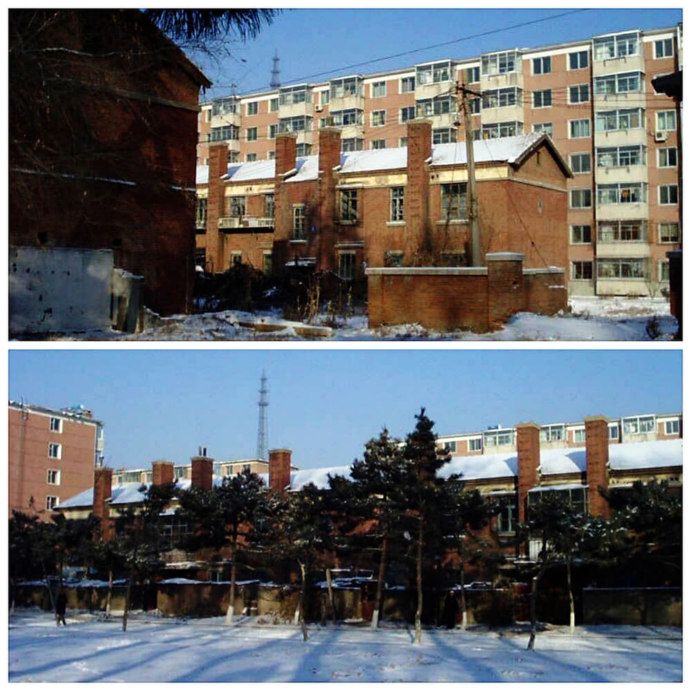
图4 二层双拼单元式住宅图

## 老校部（红楼）

下面这张图5是1985年校园航拍鸟瞰图，可以看到当时主要建筑的位置分布。

图5 吉林工大校园鸟瞰图（1985，东南向）

老校部（红楼）是吉林工业大学的标志性建筑（图6），多少年来它都作为学校的名片印制在书签、明信片、校刊、宣传资料的封面上，其形象在老一代工大人的心中永不磨灭。这座红楼的建筑史鲜为人知，其实它的设计人是大名鼎鼎的石井达朗，虽然当年他是伪满洲国国务院总务厅需用处营缮科的一位年轻设计师，但在伪满洲国首都“八大部”排名第一的伪满国务院大楼（现吉林大学基础医学院）建筑竞标中脱颖而出，中标并付诸实施，在这以后石井达朗又设计了伪满洲国交通部大楼（现吉林大学公共卫生学院），伪满洲国大同学院主楼（后来的吉林工业大学校部红楼），他在当年设计的上述三座建筑都各有特色，称得上伪满新京历史建筑中的精品，前两座因为属于著名的伪满洲国政府办公楼群的“八大部”，很早就被列入“长春市历史文化保护建筑”名录，而第三座伪满洲国大同学院孤悬吉林工大校园，未被列入上述名录，实属疏忽和遗漏，以至于在1999年被草率拆除，留下了长春建筑史上的遗憾，让人痛心疾首。

然而长春市城市规划馆却特意收藏了这个伪满洲国大同学院的建筑模型。从这个模型的正面鸟瞰观察，当年设计者在建筑空间和平面的关系上布局巧妙，在建筑造型和比例上精雕细琢，80年以后的今天仍然不失建筑精品的风采。（图6）

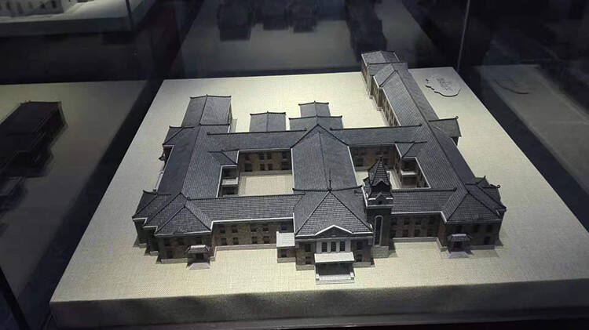
图6 长春市城市规划馆馆藏伪满新京大同学院(吉林工大校部红楼)模型

这座当年的新京大同学院的主楼，如图7所示，也是一座综合功能的建筑，以办公用房为主，内部中间设有500座的小礼堂，在吉林工业大学前30多年的岁月里一直作为工大教职员工、干部举行重要会议、庆典、上演精彩文娱节目的高级会堂。会堂的后面还设有一个大型公共浴室，是工大教职员工家属的公共洗浴场所，跟浴室并排还设有食堂。平面设计主体为日字型，东侧延伸出一些单层辅助用房, 围合成两个封闭的庭院，回廊贯穿室内空间，均朝向内部庭院，步移景迁，夏季望庭院绿叶婆娑，冬季观雾松树挂，诗情画意。这样的平面布局和室内空间不曾多见。在主入口大门厅的 一侧，布置了一座竖塔，跟两层的主体建筑形成垂直和水平的构图对比，更加挺拔突出。屋面造型独特，为十字交叉屋脊歇山屋顶，四个立面造型相同：在四个小窗的上方设有两层退台式的三角形小坡顶，造型别致而有创意，至今未见到有与之相同的造型，建筑美学价值很高。原作的塔楼屋顶坡度比较陡峭，所以看上去更加高耸。重修后屋顶坡度变得平缓。

图7 伪满大同学院主楼图

任何城市，任何独立的部门都有自身的地标性建筑，它可以起到统领和凝聚的作用，并且为人们提供记忆和标志。老校部（红楼）是校园最有特色的历史建筑，是老工大人心目中当之无愧的地标性建筑，也是校园历史沧桑的见证物，更是校园文化之魂的代表。它作为校园东西次轴线的底景，体量适当，内容恰当，跟南北主轴线上几栋近现代建筑形成有对比有传承的序列，并不冲突。可惜没有经过科学论证和评估，也没有人把它列入历史保护建筑名录挂牌保护，以致于盲目将它草率拆去。看看国外的大学名校无不以自身历史悠久，拥有众多古老的历史建筑为自豪，哪怕是一二层的小建筑甚至门卫室和校门，只要它具有历史文化价值，都精心呵护，保持原样。再看看国内大学校园的改造建设范例：清华大学、厦门大学、中山大学、湖南大学等高等学府在进行校园改建扩建时，谨慎论证，尊重校园历史沿革和原有规划机理，细致处理新旧建筑的矛盾，延续了建筑文脉的传承，改建和修缮绝不轻易大拆大改每一座历史建筑,避免破坏性的建设。历史建筑、有文化的建筑跟人一样有感情，虽然红楼是伪满时期日本侵略者所留下的建筑，但是随着时代的变迁，它也随之为使用它的新主人忠实的服务，建筑早已超越政治，当你站在它的面前，它会向你诉说它经历的沧桑和故事。人们曾经住过或光顾的老建筑，当你凝视它的时候，它会跟你一道追忆和怀念那逝去的美好时光。让你亲历的岁月好 似一曲难忘的歌，永远鸣奏在心间。如图8。

图8 1990年代的校部红楼

2015年9月吉林工业大学举行建校60周年纪念庆典，来自全国乃至世界各地的老校友返回阔别多年的母校，莘莘学子，情深意切，他们当中的许多人千万里来寻梦绕魂牵的校部红楼，却不见了踪影，旧址被一座逸夫楼所替代，在大楼的正门前台阶下摆着一座精心制作的老校部红楼模型，校友们围着这个模型，从各个角度观瞻拍照，有的人抚摸着模型感慨万千，情不自禁地热泪盈眶。（如图9）这就是地标性建筑的魅力。

图9 校部红楼模型

无独有偶，2019年8月，“吉林工大附小校友及工大子弟大团圆联欢会”在工大礼堂举行，盛况空前，气氛热烈。大会组委会为每一位报名参加的校友特意定制了一枚熠熠生辉的纪念章，纪念章的图案选定的也是老校部红楼，为什么这座建筑如此深入老工大人的心间，为什么大家不约而同地把它当做老工大的精神象征，答案是它的标志性的形象已经永远铭刻在老工大人的心中，今生挥之不去。（图10）。

图10 工大附小校友暨工大子弟团圆纪念章（2019.7）

## 一校区

另一座值得一书的伪满时期的历史建筑就是位于吉林工业大学校园东北角的一校区（图11），多年来它作为工大机械系(含工经专业)为主的教学、办公、学生宿舍综合体，内部有一个高大空间场所，作为室内体育馆，很适合东北漫长而严寒的冬季体育健身。这座外观清水红砖的两层坡顶建筑平面布局呈打横的日字型，在建筑中部正入口处设计了一个外凸的平屋顶梯形门楼，外立面用水泥砂浆罩面，跟建筑主体做工考究的红砖勾缝外立面在材料和颜色上形成对比，主入口的上方建筑主体上设计了一个高大的三角形山墙，这些处理都是为了突显主入口的地位。整座建筑的外墙在二层窗户上方做成半圆形，并且在窗户之间设计了一个突出的壁柱，这些细部设计增加了建筑的阴影，丰富了立面的体积感和灵动感。如图12。

图11 一校区内院景观图

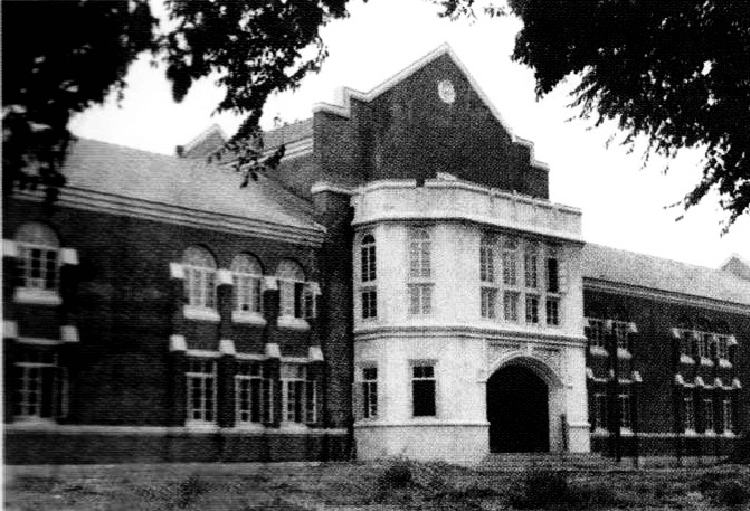
图12 1930-40年代的一校区

翻开它的建筑史，原来它是1938年建成的伪满洲国中央警察学校，是内有宿舍、办公、食堂、室内小体育馆和庭院的综合功能的教育建筑，随着时代的变迁和政权的更迭，这栋建筑里迎来送往了多少莘莘学子，演绎了多少人生故事，见证了多少历史沧桑。而它为之服务最长的单位就是吉林工业大学，不知什么时候它被斩断一半，西半部被拆去，残墙断壁，人去楼空，荒草萋萋，如图13所示。

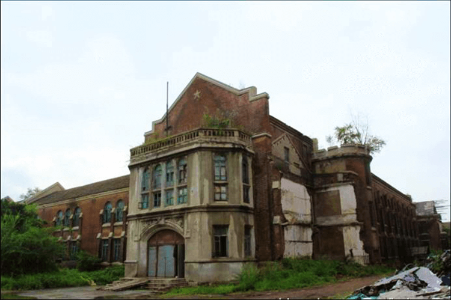
图13 被拆去西半部的一校区

虽然它命运多舛，但是还是比校部红楼要幸运。长春市人民政府有关主管部门在2016年7月把“长春市历史建筑”的牌匾挂在了它那饱经历史沧桑的门廊上，并且在2017年11月特制了一座“伪满洲国新京中央警察学校旧址”的石碑立在这座先于死地而后生的历史建筑前面，这座传奇式的建筑成为长春南岭地区仅存的少量伪满时期建造的历史建筑，我们期待着它的抢救性修缮和重生。如图14所示。

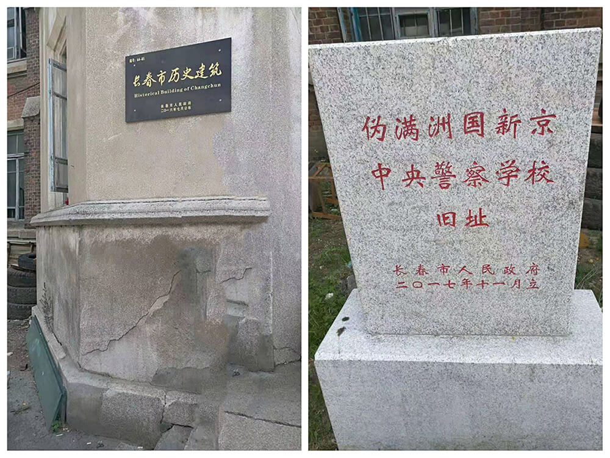
图14 市政府将一校区列入“长春市历史建筑”的保护名单

## 二校区

二校区建设初期是合同学校，1935年曾做过伪满洲国司法部法学校。1936年又迁到后来的三校区。建筑坐南朝北，二层砖混结构，主楼位于中间有凹入式五柱四间的门廊，西北侧穿插一个凸出主立面的半圆型垂直体块，跟水平铺开的的主楼形成对比，半圆型垂直体块向南延伸出一个通廊，串联了四栋平房，形成若干院落，典型的三十年代的日本近代建筑的建筑布局和造型。如（图15）。1955年-1982年，二校区作为机械二系(含工经专业)的教学、办公、学生宿舍多年，后面的平房部分用作实验室、教研室等功能。二校区在改革开放以后校园建设中最早拆除，改建为学生第二食堂和第十二学生宿舍。

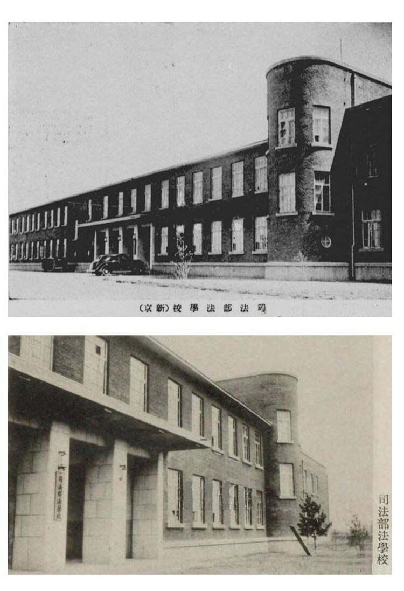
图15 1930年代二校区建筑

## 三校区

三校区为二层砖混结构坡屋顶，内部平面布局以授课教室为主(图16)。1938年1月，司法部法学校被撤销，校舍成为新设的“地方司法职员训练所”。同时，新成立的“中央师道训练所”（1944年更名为“中央师道学院”）也迁入此建筑内，二者共用该校舍。1938年12月，根据伪满国务院颁布的大学官制，在以往“司法部法学校”的基础上，于1939年1月成立了“新京法政大学”，改由文教部管辖。目前是校园历史建筑年代最悠久,保存最完好的建筑，平面布局为日字型 (图17) ，中部也有一个高达两层的多功能厅做为风雨操场，用作大学生阴雨天和冬季的体育教室。内设室内篮球、羽毛球场；目前楼龄80年以上。

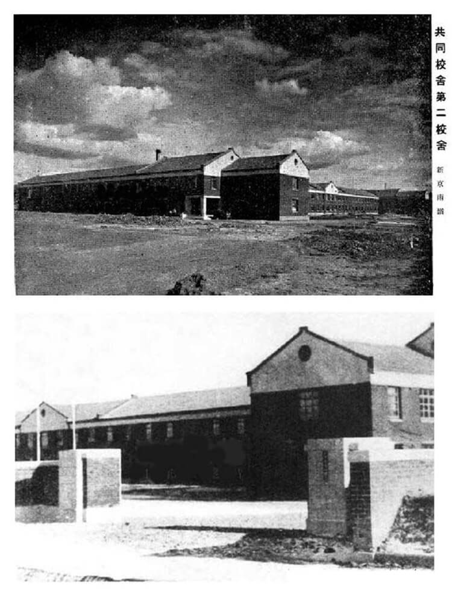
图16 1930年代的三校区

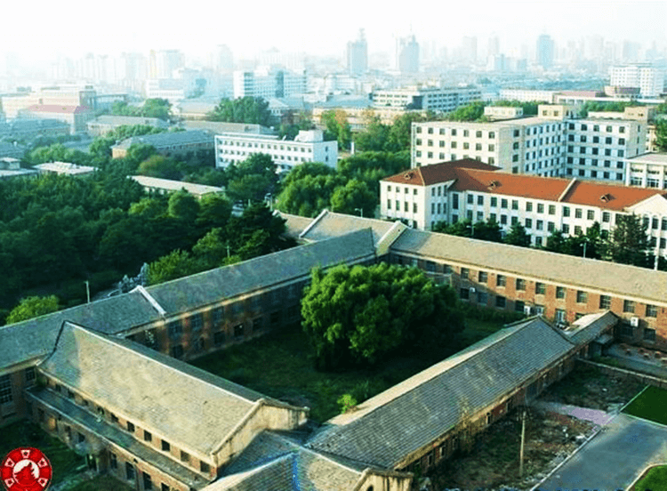
图17 三校区现状，其后红色屋顶的为一教楼

## 四校区

四校区是两幢二层四坡顶，砖混结构,红砖外墙，两座楼相对而立于道路两旁，凹字型的平面各自形成庭院，建于1937年2月，留存至今。这两幢建筑曾经是伪满新京财务职员养成所，即伪满新京财务职员训练班所在地。这个机构直属伪满经济部，为日伪培养和训练中级税务、海关及专卖等专业人员。伪满经济部大臣韩云阶兼任所长。工大建校后四校区一直作为学生宿舍，内部带有食堂，单面走廊，西面的一座在1960年代曾住过越南留学生，楼龄82年。（如图18）。

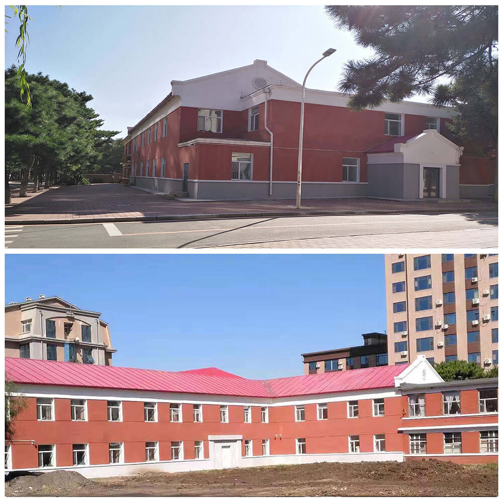
图18 四校区现状（西北面、东南内院）

北区在短暂的东北光复后的国民党统治时期和吉林师范大学校园一同归入长春大学，以后一直没有任何建设活动。直到1955年吉林工业大学接收以后，一、二校区改为机械系的综合楼：办公教研室、学生宿舍、食堂、风雨操场；三校区改为教研室和实验室，四、五校区则改为学生宿舍和学生食堂、部分作为制图教室。吉林工大附小使用新京工业大学的工科学校留存的校舍，1955年长春汽车拖拉机学院建校初期选择此处作为子弟小学，故拆除了南面临街的二层主楼和后面的庭院及一排平房，保留了北面的三排平房做校舍，退让出一个宽阔的大操场，保留至今。平面呈E型，左侧一条南北通廊，连接了三栋平房建筑，直到1983年迁到新校舍，在此培养了二十多届毕业生，原校舍腾给幼儿园使用，该建筑1999年拆除建成第十三学生公寓。现在原小学校舍南面的一排老杏树还安在，每到春季杏花依旧笑春风，似乎在陪伴着历届老附小的校友们一起变老。而以上建筑多为红砖勾缝清水墙，单层、二层砖混结构，灰色机平瓦坡屋顶，竖向木制窄窗。一校区、二校区则为平屋顶现代风格，有欧洲近代造型元素。

## 礼堂

在校部楼（红楼）北侧的吉林工业大学礼堂是建校初期大约1955-1956年左右建成使用。观众厅是经典的钟形平面，设有池座和楼座，约1500座，属于大型影剧院。它是解放后至文化大革命以前长春市建造的最大规模的影剧院建筑。内部空间高大，舞台宽阔，可放映宽银幕电影，也可举行大型话剧、杂技、舞蹈等表演活动，所以大礼堂经常被长春市其他单位借用举行大型庆典和表演，利用率很高，声名远扬。大礼堂的交通流线组织是正进侧出，就是从正面大台阶或两侧坡道拾级而上进入大门厅，终场散会从观众厅两侧太平门疏散。大礼堂正立面是五根简化了的古典科林斯柱廊，承托着高高的女儿墙，遮挡住三角形的坡屋顶，矗立在高高的大台阶上，东西两侧有弧形坡道。外观朴实无华而不减巍峨庄重。是50年代长春市中国人自己设计建造的影剧院建筑当中优秀的一例。(图19)

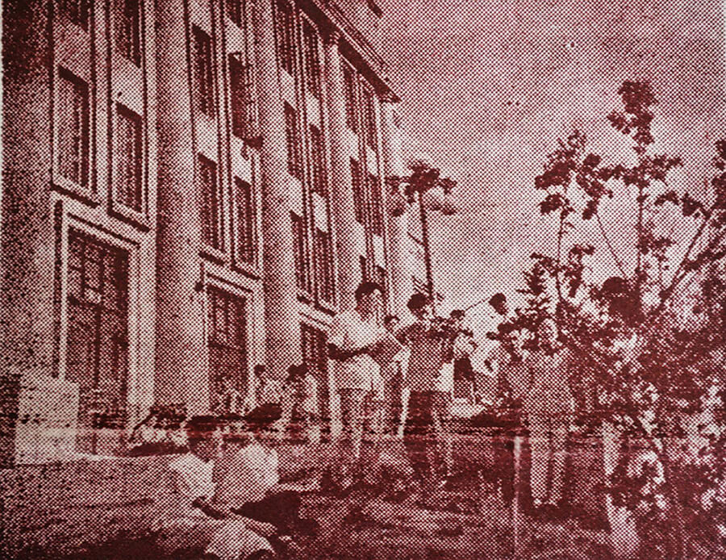
图19 1960年代的大礼堂

大礼堂后来因内部结构问题，曾进行过改造，并进行了抗震加固，把原有的木屋架换成了钢桁架，保护了这座老建筑的长存功不可没，值得提倡。但整座建筑外观被改的面目全非这不可取，如图20，展显在人们面前的大礼堂的建筑风格既非现代也非古典，既没有了历史建筑的韵味，也比不上真正的现代建筑。与其这样不如使用新的材料保留它的原貌，是完全可以做到的。

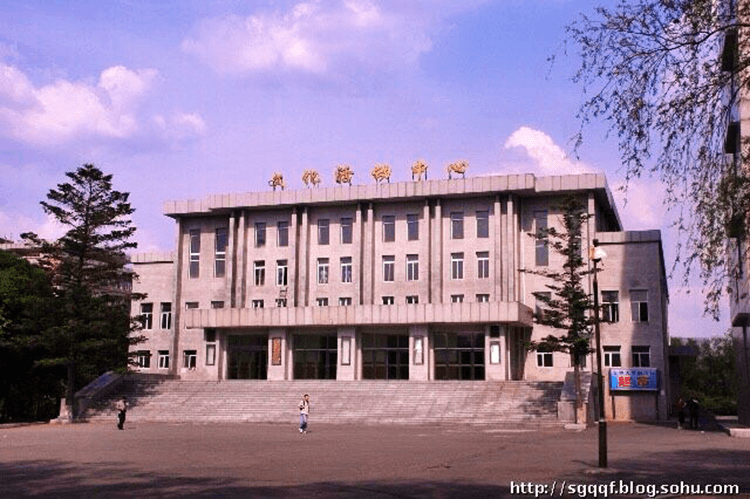
图20 改建后的大礼堂

## 一教

三校区北侧的第一教学楼大约建于上世纪1955-1957年间，是前长春汽车拖拉机学院建院初期所建第一座教学楼，平面呈工字形，坐北朝南，中轴对称，舒展端庄。东西两端各设两个出入口相对的阶梯教室，外观清水红砖勾缝，灰色机平瓦四坡屋顶，主入口位于中部，庄重不失温馨，典型的上世纪50年代大学教学楼布局和造型，如今它历经60多年的沧桑，巍然挺立，风采依然，算得上吉林工业大学校园建筑的元老，向人们诉说着校园的历史变迁，这就是它的价值所在。(图21)、 (图22)。

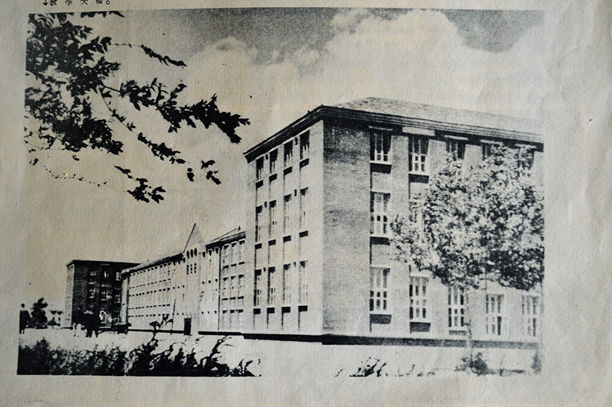
图21 1950年代的第一教学楼

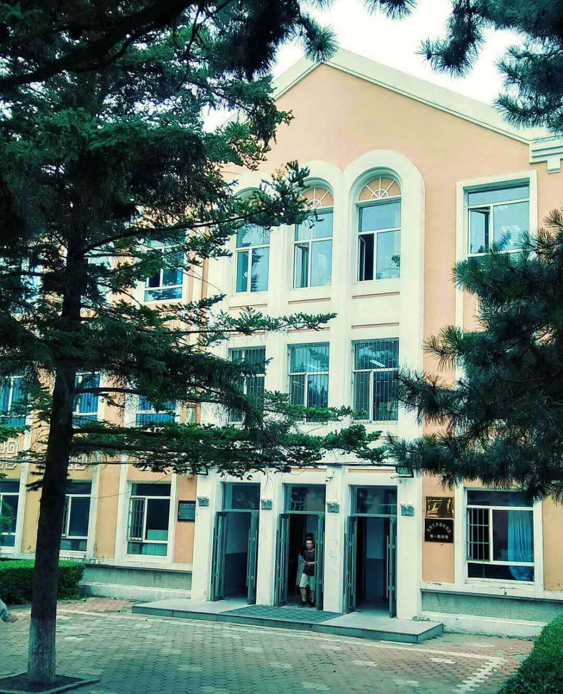
图22 第一教学楼现状

## 二教

第二教学楼大约建于1960年前后，当时规划布置在吉林工业大学校园的最中心位置，也考虑了将来会在它的北面或南面建设图书馆、教学楼，形成南北中轴线。本意是把这座教学楼建成当时规模最大的教学主楼，因此原设计是五层，由于当时正值国家自然灾害恢复时期，国民经济下行，为了节约投资，减去了一层，所以建筑外观比例看上去有些扁平，留下了遗憾。建筑为平屋顶现代风格，局部（檐口和正立面室外大楼梯栏板上部）略加少许传统纹饰。外立面为米黄色饰面砖，造型对称大气，稳重端庄。建成以后它的整个首层一直做为校图书馆和教师阅览室直到80年代初图书馆新楼建成。随着时代发展，它难以再胜任教学主楼的重任，但它在校园的中心位置不可替代。（图23）

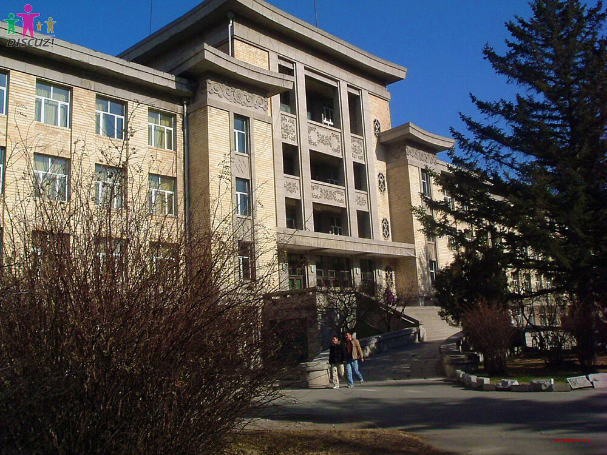
图23 第二教学楼英姿

## 学生公寓

位于校园西北角跟东北师大一路之隔的学生公寓楼群建成于上世纪1962-1963年间，至今也有57年了。这里一共有三座四层学生公寓，跟家属宿舍新五栋围合成一个大院，（图24）在这个院子里发生过多少令人心潮澎拜和平凡的故事。建成以来它们一直被冠名为农机楼、汽车楼和动力楼，分别为以上三个系的学生沿用，后来动力楼改为女生楼（八十年代改名为电子楼，住有电子工程系的学生等），其余两座没有更替。三座学生楼外观和平面布局完全相同，内部设两步楼梯，内廊双面房间布局，只是朝向和出入口有区别。它是1960年代典型的东北地区高等院校宿舍楼的布局和造型，封闭、对称，房间门对门，整齐划一，大公共卫生间。如今已换成红瓦的坡顶建筑，虽已苍老，布局落伍，但也记录了学校发展历史的沧桑，让在此住宿过的代代学子追忆着那些曾经度过的青葱岁月，难以忘怀。（图25）。

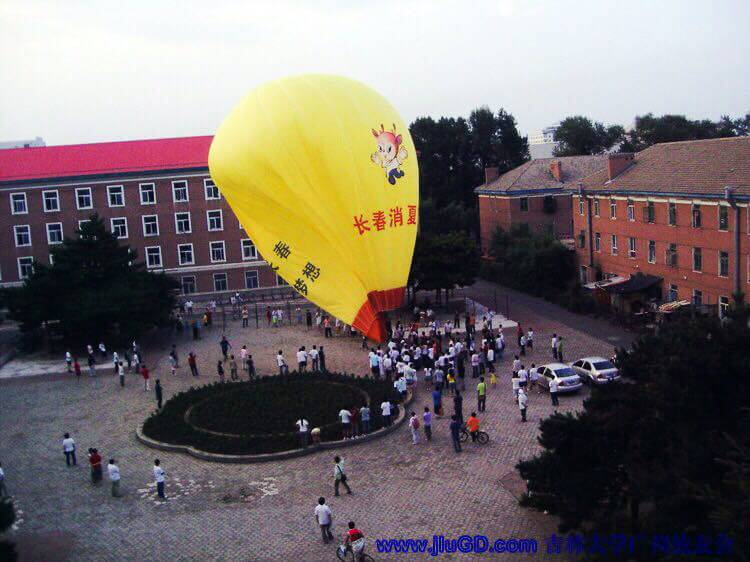
图24 农机楼和新五栋

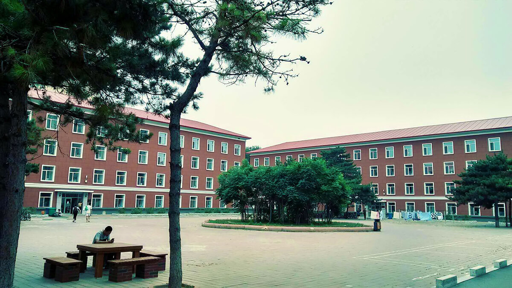
图25 汽车楼和农机楼

比邻三座学生公寓楼东侧的新五栋建成于1957年，是建校初期设计建造用于安排讲师以上教师、科级以上干部的家属住宅区，至今已有58年的历史，这个家属住宅区由五座三层的住宅楼组成，楼房的外墙是清水红砖勾缝，浅绿色双层木窗，灰色机平瓦四坡屋顶。五栋楼围合成一个近似封闭的大四合院，中间是树林和草坪，这种规划布局属于周边式布局，住宅沿院落周边布置，形成封闭的或半封闭的院落，便于绿地集中、邻里交往、节约用地、防风防寒。缺点是出现部分东西朝向住宅，不利于日照和通风，一般较适用于北方寒冷和多风沙地区。这种手法是从前苏联引进的，长春一汽老宿舍区规划也属于这种类型。如今新五栋家属住宅区已经全部拆除，绝尘而去，旧址在并校以后整块土地被拍卖出让给开发商，校园这块土地从此被分割出去。由于太靠近学生宿舍区，功能相互干扰，虽然这种几十年前的规划已经落伍，但是它毕竟在吉林工业大学校园的建设历史上曾经闪光。（图26）。

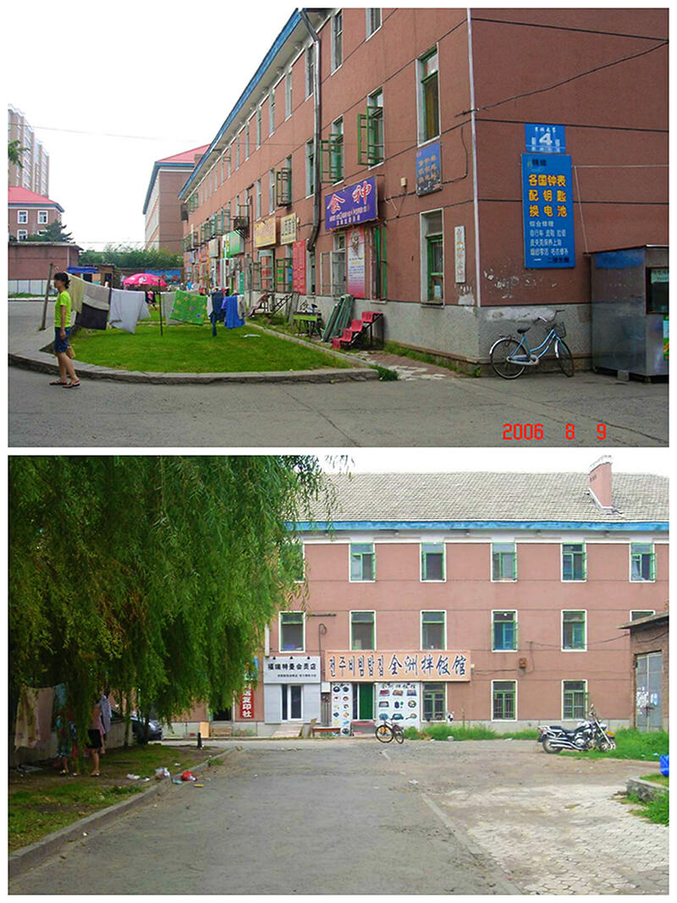
图26 2006年的新五栋（上为新四栋；下为新三栋）

此外还有五八楼, 顾名思义是1958年建设的单身宿舍和刚成家的教职员工宿舍,中间走道,公共卫生间; 鸳鸯楼,为新婚职工所建的新婚过渡房,可见当年建设的人性化,以上两座老建筑保存至今。

## 图书馆

图书馆大楼做为改革开放后校园建设的第一栋新建筑而载入史册。历史记载在文革以前吉林工大的领导已经向当时所属的农机部申请立项，选址在第二教学楼的北面或者南面两个位置，并倾向于在二教楼的北侧，因为这个位置更靠近学生宿舍和教学区。但当时国家刚从60年的三年自然灾害中走出困境，资金紧张，项目暂缓。随着文革的的爆发，该工程一搁置就是二十来个春秋。改革开放春风化雨，教育先行，工大图书馆在部属院校中最早被获准上马，筹备组分析了现状，确认在第二教学楼北侧选址设计，建筑面积：11358平方米，主楼6层位于南侧，书库5层位于北侧，完全从功能合理和气候条件出发，采用传统图书馆前主楼,后书库的中轴对称平面布局,阅览室、自习室、办公室位于南侧，辅助用房和藏书库位于北侧。大阅览室中间不设内走廊，南北通透，通风采光良好。建筑造型朴实无华，庄重大气，跟第二教学楼一起奠定了校园南北中轴线。项目1980年动工,1984年完工交付使用，为当时东北地区高等院校图书馆规模之最，至今已接近40年。（图27）

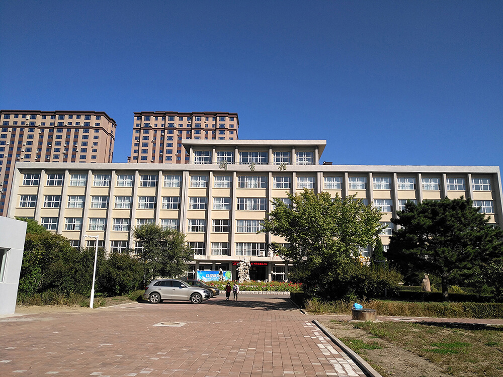
图27 工大图书馆

## 基础科学实验楼

在这以后于南北中轴线上的第二教学楼北面建设了基础科学实验楼，图书馆北面的留学生楼。随着国家和机械工业部的财力物力的投入，招生的扩大，吉林工大在1985—2000年的15年间，校园建设规模达到高潮，先后新建了体育馆、逸夫教育大楼、能源与动力大楼、公共计算机教学与研究中心、汽车工程学院（车辆产品检测实验楼）、生物与农业工程学院。新建改造10栋学生宿舍和配套食堂，全面拆建原家属住宅区：南区（官舍）、土炕平房住宅区、南岭小街工大新村住宅区。这个时期的建设量是校园作为教育用地前几十年建设量的数十倍。特别是家属住宅独立成区，跟教学区互不干扰。并将校医院、幼儿园、小学等功能靠近家属住宅区，商业服务兼顾学生宿舍区的布局十分合理。

吉林工大校园存在一些历史建筑，它们的保护和更新跟校园建设是一对矛盾，由于那个年代当地政府和有关领导的相关意识还未提高到现在的水平，以及建设资金的局限，出现了急功近利的现象。当然大部分老旧建筑中的平房、小型二层建筑，浪费土地空间，年久衰败，保留价值不高完全应当拆旧建新。但有些价值较高，甚至是老校园标志性的建筑则应该保留和更新，比如老校部红楼、一校区原机械一系，二校区原机械二系主楼（不包括后面平房）等。

## 校园平面图 1990

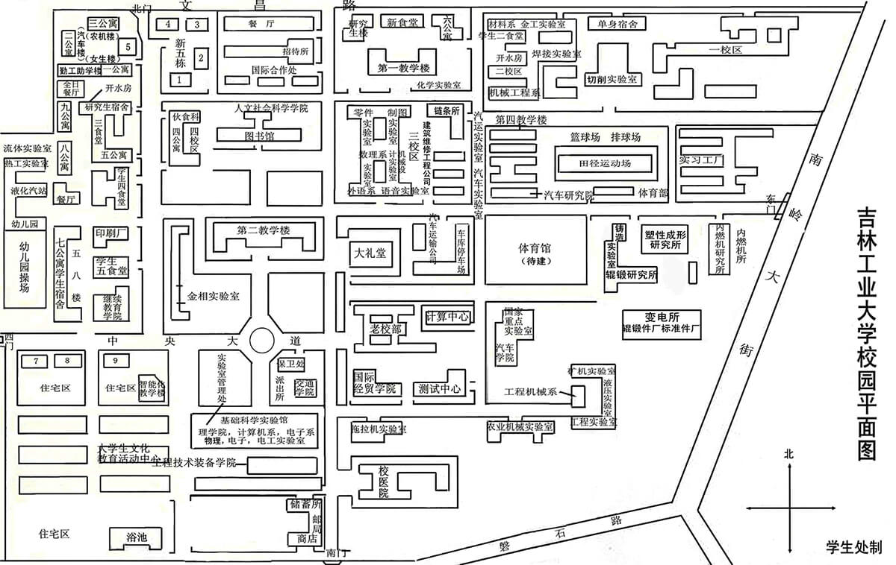
图28 1990年代吉林工业大学校园平面图

从吉林工业大学校园的1985-1990年总平面规划图上分析（参见图28，图29，图30），校图书馆、第二教学楼、基础科学研实验楼三座主要建筑从北到南依次排列在校园南北中轴线上，形成校园重要建筑的南北主轴，尤其从空中鸟瞰校园，从航拍图（图31）上看，如果仍保留红楼作为校部的功能和校园标志性建筑，在它的后面（向东移）盖一座高层的逸夫楼，做为东西轴线的底景，则这个轴线纵深可以延伸，校园更有气派，笔者的观点是应该把那座逸夫教育大楼移到最东端现在的能源与动力大楼那个位置，做为校园东西轴线的底景，从老校部红楼南北两侧向东延伸两条路通达逸夫楼前，两条路围合出一个长方形的绿化景观带，在这条景观带的南北两侧布置体育馆、能源与动力大楼、生物与农业工程学院、汽车工程学院、管理学院交通馆、公共计算机与研究中心等。而保留东西主路进入主校门的对景：标志性历史建筑——校部红楼作为校园视觉中心，因为现代轴与历史轴在此交汇融合，校园空间景观会更加有层次，更有韵味，更引人入胜。虽然以上建议为时已晚,但应该以史为鉴,以示后人。现状的以上几栋建筑布局散乱拥塞，空间无序，基本上没有景观绿地。这就是事先没有合理的规划，随意建设，见缝插针所造成的遗憾。

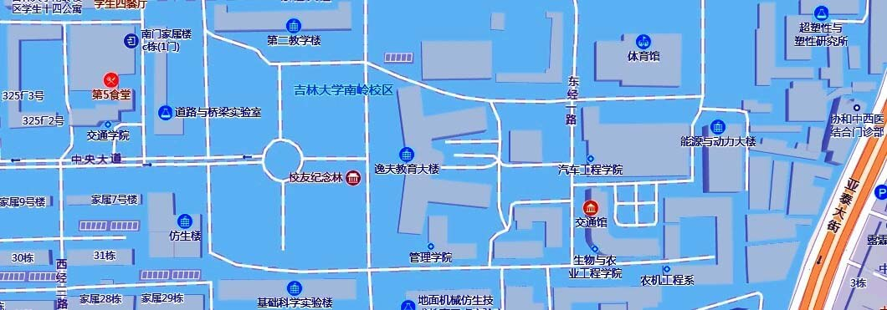
图29 逸夫楼与能源动力大楼之间的现状建筑散乱、空间无序

历史建筑的保护和更新跟校园建设是一对矛盾，但大专院校都以建校历史的悠久引以自豪，教育成果的积累、校园风貌的独特，历史建筑的遗存，这些都是学校的历史文化积淀，几代人的薪火相传，长盛不衰的展现和标志，在校园的规划和建设中应对此内容谨慎又谨慎，改造和更新时遵循的原则应该是“整旧如旧”，既然跟全新的国内其他大学城建筑根本都无法攀比，只有根据自身的历史、特点、风格、布局因地制宜，尊重历史和现状，发掘自己的价值，才是科学的发展观。切忌浮躁跟风，追赶时髦，喜新厌旧。

对保留的校园历史建筑，一律将外饰面为清水红砖这一特色的原有建筑统统覆盖，全部罩上彩色涂料，加设窗套，使得具有半个世纪以上历史沧桑的建筑失去了古典的、原本的美和纯朴，也不具备现代建筑的风采，因为全部整齐划一的外粉砂浆罩涂料的建筑实在是档次太低，耐久性差。其实现在对历史建筑有很多手法可以借鉴：可以去陶瓷厂定做原来红色的同样规格的外墙面砖，铺贴上去即可保持原貌，又可保护和修缮老旧的墙体。窗户可以仿原有木窗的质地和颜色到铝合金厂家去订做，屋面瓦也可以仿制，均不必改变原来的颜色和质地。当然，历史建筑的保护和更新是当今世界一门较新的专业，不可能要求所有接触到这一类工作的人都能自觉地接受和专业化地处理这些案例，任何新观点新事物都会有一个接受的过程，有必要还要立法才能见效。

## 校园鸟瞰图 1985

图30 吉林工大校园鸟瞰图（1985，南北向）

还有一个新建筑和历史建筑相互协调和呼应的问题。从1985年拍摄的这一张吉林工业大学校园鸟瞰图上看，如图30，那些清水红砖，灰白坡瓦顶的建筑风格是老吉林工大的建筑风格主调，在绿树的衬映下和谐而自然，沧桑而温馨，如果在这以后的校园改造和建设能保持老校园本源风貌，制定周密的改造方案，对老建筑“整旧如旧”，新建筑继承文脉，和谐相处，既有传承也有时代的创新才能永保校园的历史文脉和特色。

以上是吉林工业大学校园建设发展史，以及一部分50年以上的历史建筑的探源和考证，回顾之余，深深地为校园建设发展的历史源远流长而感叹，40年后，1980—2000年代兴建的校园建筑也将加入历史建筑的行列,（图31），这张近期校园鸟瞰图与1985年同一视角的图30今昔对比,已是沧桑巨变，换了人间。岁月悠悠，历史变迁，那些历史建筑之所以宝贵，因为“建筑是石头的史书”， “建筑是凝固的音乐”。它们犹如石头的史书将经历过的风雨岁月都一一记载下来，留给后人，它远远超越政治，为它在各个历史时期的主人忠于职守，所以我们应该尽力去维护它们，修缮它们，让它们尽可能长久地陪伴我们，作为历史的见证，作为文化遗产的保护，作为教育的载体，这才是一个文明、开放、包容、源远流长的民族应有的品质和胸怀。

## 校园鸟瞰图 2015

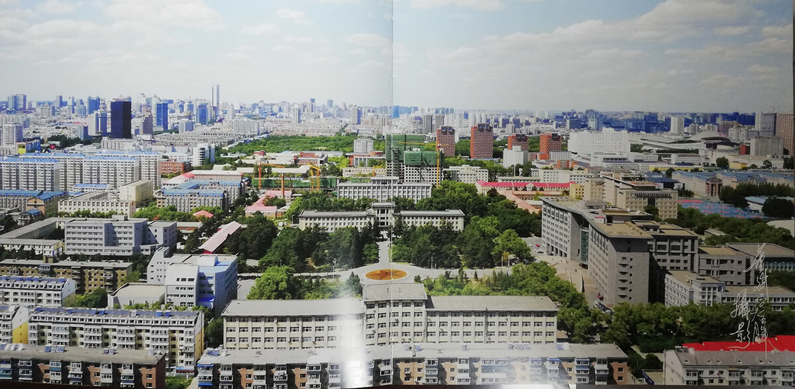
图31 吉林工业大学校园鸟瞰图（2015，南北向）
