修订版

作者：南粤清风（袁幸）老工大子弟 国家一级注册建筑师

2019 年 9 月

[在线链接](http://www.weixinyunduan.com/weiweb/348175/bf3e0e561282dc76625f3ac9.html)

> 在祖国母亲 70 周年华诞，在吉林工业大学建校 64 周年来临之际，谨以此文献给： 
> 每一位为学校的建设和繁荣添砖加瓦的校友； 
> 每一位曾经在这个校园工作、学习，并与之同呼吸共命运的人； 
> 每一位从小在这个校园里生活、长大，见证了它的历史变迁的人； 
> 因为吉林工业大学在我们每一位的心中永远长存！ 

> 前言：笔者曾在2015年9月写过《吉林工业大学校园建设和历史建筑的沿革探源》一文，原版有幸受到诸多工大校友们的关注。此次应吉林工大汽车系64、65届老校友出版《珍藏奋进》纪念回忆录编委的邀请，收入此文。借此机会对这篇文章进行修正和勘误，并充实了内容和图片，在标题后面加注了括号（修订版），以示区别。此文的目的是为吉林工业大学的校园建设与发展做一篇“史记”，留给后人，永誌怀念。因为我为吉林工大的校园发展和建设的漫长足迹而感慨，为每一代老工大人为校园建设的丰硕成果所付出的辛劳智慧而感动，这一切不能因为学校的更名而被抹去，而被遗忘。希望这一版能够展现出一个内容更加详实，图片更加清晰，情感更加真切的篇章，以答谢各位读者的热情支持。

吉林工业大学组建于1955年，原名长春汽车拖拉机学院，是由原交通大学（现分为西安交通大学和上海交通大学）、华中工学院（现为华中科技大学）和山东工学院（现为山东大学）的汽车、内燃机等有关专业为基础合并组建而成。她是新中国第一所培养汽车、拖拉机、农业机械人才的高等学府。当时隶属于国家第一机械工业部。1958 年11 月改名为吉林工业大学。是国务院首批批准授予博士学位、硕士学位和学士学位的高校之一。1997 年5 月，通过立项审核，成为国家“211工程”首批重点建设的27所院校之一。吉林工业大学是一所以汽车、农机为优势和特色，理、工、管、文相结合多科性大学。1998 年9 月，隶属于国家教育部直属高校。在以吉林工业大学命名的46年间，为国家的汽车工业、农业机械、机械工程及机电自动化等领域培养和造就了大批高层次人才，长江后浪推前浪，有目共睹，有据可查，功不可没，其建校历史源远流长。

学校园区占地面积为965亩，校园东西最长距离为1225米，南北最长距离为800米。校园中央大道西侧原校门旧址处，即中国科学院长春光学精密机械与物理研究所东围墙，距离人民大街255米。学校园区海拔高度为215.5米至223米，地形标高差为10米。校园区地势比较平坦，形成南高北低，由东南向西北顺次递降，地面坡度为9.5﹪。

2000年6 月，吉林工业大学与原吉林大学、白求恩医科大学、长春科技大学、长春邮电学院合并组建新的吉林大学。现在的校址叫吉林大学南岭校区（即：吉林大学工学学科、工学部、东区）。

吉林工业大学的校园建设历史可追溯到上世纪的1930、1940年代的日伪时期，长春在日本帝国主义侵略统治达14年之久，日寇于1936年成立伪满洲国，并选定中长铁路的中点长春，历史上叫“宽城子”的铁路附属地的地方扩城建设为国都，更名为“新京”，并进行了伪满洲国新京的详细规划，从“新京市街地图”（图1）上 寻找吉林工业大学的校园范围，以及东北光复以后1945年由前苏联绘制的“长春（新京）全图”英文地图上分析，现在的吉林工业大学校园，上世纪30、40年代时分为南北两个片区，以老校部楼（红楼）至西大门（吉林工业大学正校门）的校园东西向主路中央大道为分界线，北区是日伪时期规划的院校区，当时建成的有中央警察学校（一校区）；合同学校—司法部法学校（二校区）；司法部法学校、中央师道训练所（三校区）；伪满新京财务职员养成所，即伪满新京财务职员训练班（四校区）；合同学校（五校区）；大同学院（老校部红楼）；新京工业大学附属工科学校（原吉林工业大学附属小学平房校舍）。

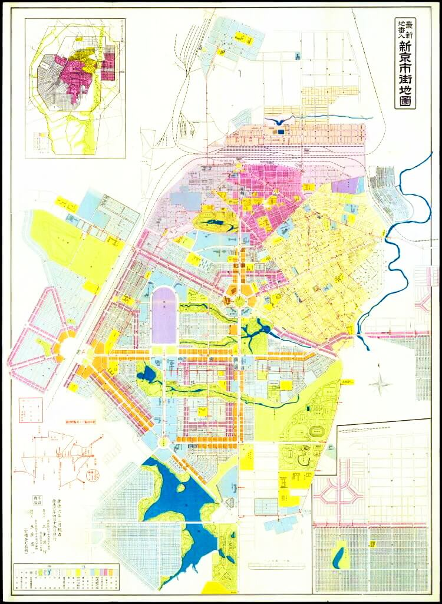
图1 新京市街地图

从图2中可以看出，当年的新京工业大学和新京医科大学都分别规划在一个完整的地块中，特别是原吉林工大附小校舍的前身是新京工业大学附属工科学校，一共有四排平房，最南面临中央大道是一座二层高的主楼。而跨过亚泰大街在道路东侧，还规划有新京工业大学的寄宿舍，多达六栋建筑。可见当年新京工业大学所占比重之大，人数最多，除了新京工业大学的寄宿舍以外以上其他内容在后来的长春汽车拖拉机学院建校时一并归入其校园。 在东北师范大学生物系原址规划建设有新京医科大学；体育学院原址规划建设有新京工业大学，目前只保留了临人民大街的主楼，以及东侧的四百米运动场，其余附属建筑均拆除；这一片文教区都是只建设了一部分，未完成全部规划内容。以上内容比较杂乱，变化频仍，并不属于同一所学校，还出现一些“合同学校”的名字，说明伪满时期对此片区的规划为大中专院校功能，根据未来发展需要再确定学校的内容和名称。所以几个学校的布局很分散，空旷而缺乏有机联系。估计这片“大学城”还未来得及继续发展就因日本侵略者的战败而终止了。

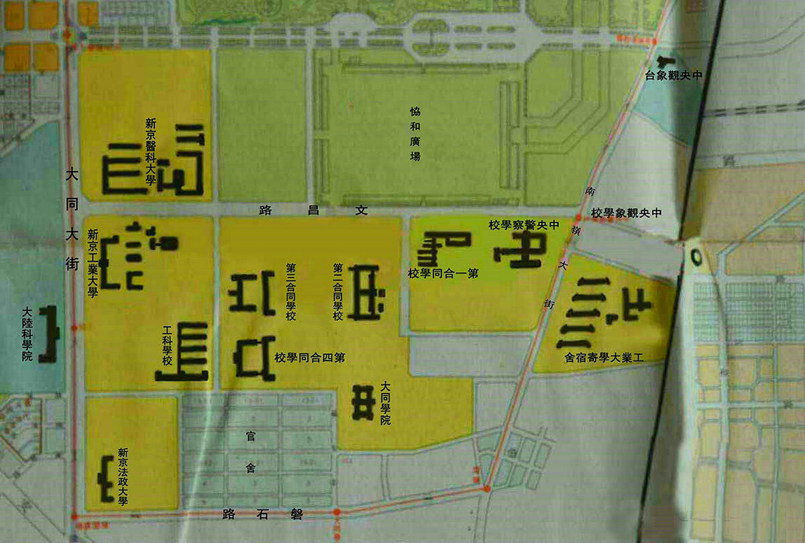
图2 伪满新京南岭院校科研片区地图

1957年校务会议决定将校园划分为五个教学与宿舍园区，分别冠名一至五校区，五大校区奠定了学校几十年的校园区域的划分直到80年代,对照图2，五个校区分别对应：

* 一校区（伪满中央警察学校）
* 二校区（第一合同学校，即伪满司法部法治校）
* 三校区（第二合同学校，即伪满司法部法治校、中央师道训练所）
* 四校区（第三合同学校，即伪满新京财务职员养成所，即伪满新京财务职员训练班）
* 五校区（第四合同学校）
* 老校部红楼（伪满大同学院）
* 官 舍（伪满新京科研院校区、伪满新京日军驻长部队家属住宅区）
* 工大附小 （新京工业大学工科学校）

南区在伪满新京地图上标注为“官舍”，规划为家属住宅区，据分析除了当时部分“大学城”区的各院校家属居住在此以外，还住有和校园南面磐石路一路之隔的伪满洲国新京日军驻长部队的随军家属，从地图上查找分析，军营内没有布置家属住宅用房。而这个新京日军驻长部队旧址一直以来都是军事用地。在9.18事变以前是张作霖东北军的军营叫南大营，东北沦陷后日本人接管后也把它做为驻长春部队的兵营。解放以后这个旧址划拨给中国人民解放军空军长春第九航校。从当年这一片叫“官舍”的住宅区留下的住宅的档次和形式可见当时日本军队官位的等级分明，按官阶的高低排列成以下顺序如 图3所示：

1、原校部西侧的七栋现代风格的二层独立式别墅为最高级别
2、原空军长春第九航校领导家属住宅（10栋双拼式单层住宅）为第二级。
3、二层双拼独立单元式住宅（共11栋一梯四户）为第三级。(图 4 )。
4、靠近住宅区南侧校园东西主路的数栋联排式平房住宅为第四级。

这些日式住宅都是现代风格，说明上世纪30年代日本国已经引进西方现代建筑的设计和建造手法。厚墙体，双层木窗，无阳台，以适应东北漫长的冬季严寒。外墙饰面颜色以土黄、米黄涂料、清水红砖为主。特色是屋顶都有烟囱伸出，当年新京没有集中采暖，所以设置分散式家庭小锅炉自行烧水采暖。

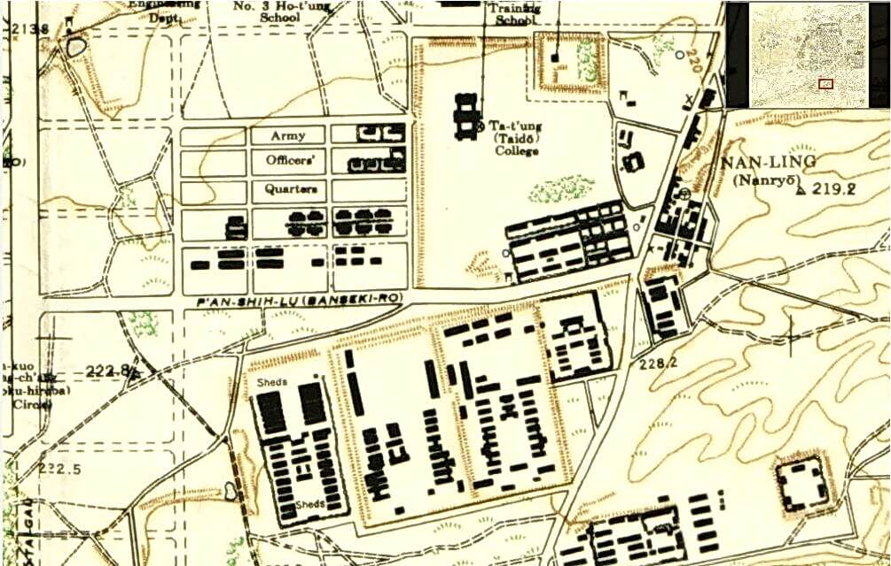
图3 1945年吉林工业大学旧址南区和日本驻军南大营旧址区地图

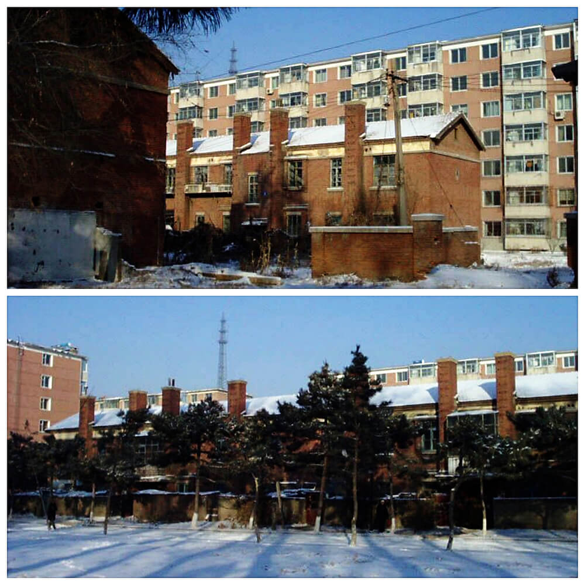
图4 二层双拼单元式住宅图

下面这张图5是1985年校园航拍鸟瞰图，可以看到当时主要建筑的位置分布。

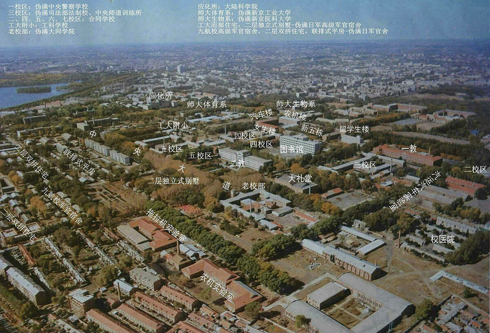
图5 吉林工大校园鸟瞰图（1985，东南向）

老校部（红楼）是吉林工业大学的标志性建筑（图6），多少年来它都作为学校的名片印制在书签、明信片、校刊、宣传资料的封面上，其形象在老一代工大人的心中永不磨灭。这座红楼的建筑史鲜为人知，其实它的设计人是大名鼎鼎的石井达朗，虽然当年他是伪满洲国国务院总务厅需用处营缮科的一位年轻设计师，但在伪满洲国首都“八大部”排名第一的伪满国务院大楼（现吉林大学基础医学院）建筑竞标中脱颖而出，中标并付诸实施，在这以后石井达朗又设计了伪满洲国交通部大楼（现吉林大学公共卫生学院），伪满洲国大同学院主楼（后来的吉林工业大学校部红楼），他在当年设计的上述三座建筑都各有特色，称得上伪满新京历史建筑中的精品，前两座因为属于著名的伪满洲国政府办公楼群的“八大部”，很早就被列入“长春市历史文化保护建筑”名录，而第三座伪满洲国大同学院孤悬吉林工大校园，未被列入上述名录，实属疏忽和遗漏，以至于在1999年被草率拆除，留下了长春建筑史上的遗憾，让人痛心疾首。

然而长春市城市规划馆却特意收藏了这个伪满洲国大同学院的建筑模型。从这个模型的正面鸟瞰观察，当年设计者在建筑空间和平面的关系上布局巧妙，在建筑造型和比例上精雕细琢，80年以后的今天仍然不失建筑精品的风采。（图6）

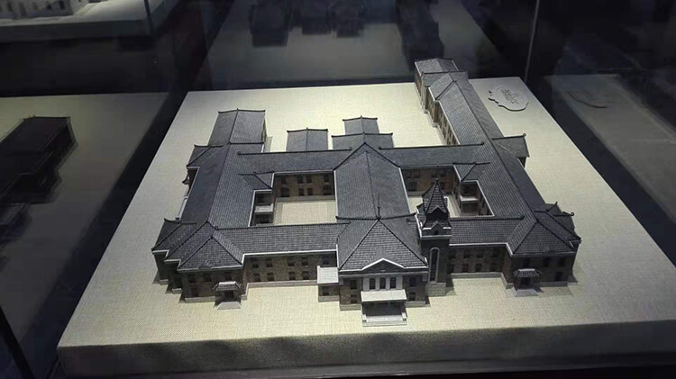
图6 长春市城市规划馆馆藏伪满新京大同学院(吉林工大校部红楼)模型

这座当年的新京大同学院的主楼，如图7所示，也是一座综合功能的建筑，以办公用房为主，内部中间设有500座的小礼堂，在吉林工业大学前30多年的岁月里一直作为工大教职员工、干部举行重要会议、庆典、上演精彩文娱节目的高级会堂。会堂的后面还设有一个大型公共浴室，是工大教职员工家属的公共洗浴场所，跟浴室并排还设有食堂。平面设计主体为日字型，东侧延伸出一些单层辅助用房, 围合成两个封闭的庭院，回廊贯穿室内空间，均朝向内部庭院，步移景迁，夏季望庭院绿叶婆娑，冬季观雾松树挂，诗情画意。这样的平面布局和室内空间不曾多见。在主入口大门厅的 一侧，布置了一座竖塔，跟两层的主体建筑形成垂直和水平的构图对比，更加挺拔突出。屋面造型独特，为十字交叉屋脊歇山屋顶，四个立面造型相同：在四个小窗的上方设有两层退台式的三角形小坡顶，造型别致而有创意，至今未见到有与之相同的造型，建筑美学价值很高。原作的塔楼屋顶坡度比较陡峭，所以看上去更加高耸。重修后屋顶坡度变得平缓。

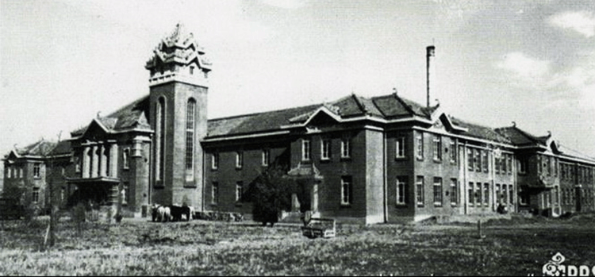
图7 伪满大同学院主楼图

任何城市，任何独立的部门都有自身的地标性建筑，它可以起到统领和凝聚的作用，并且为人们提供记忆和标志。老校部（红楼）是校园最有特色的历史建筑，是老工大人心目中当之无愧的地标性建筑，也是校园历史沧桑的见证物，更是校园文化之魂的代表。它作为校园东西次轴线的底景，体量适当，内容恰当，跟南北主轴线上几栋近现代建筑形成有对比有传承的序列，并不冲突。可惜没有经过科学论证和评估，也没有人把它列入历史保护建筑名录挂牌保护，以致于盲目将它草率拆去。看看国外的大学名校无不以自身历史悠久，拥有众多古老的历史建筑为自豪，哪怕是一二层的小建筑甚至门卫室和校门，只要它具有历史文化价值，都精心呵护，保持原样。再看看国内大学校园的改造建设范例：清华大学、厦门大学、中山大学、湖南大学等高等学府在进行校园改建扩建时，谨慎论证，尊重校园历史沿革和原有规划机理，细致处理新旧建筑的矛盾，延续了建筑文脉的传承，改建和修缮绝不轻易大拆大改每一座历史建筑,避免破坏性的建设。历史建筑、有文化的建筑跟人一样有感情，虽然红楼是伪满时期日本侵略者所留下的建筑，但是随着时代的变迁，它也随之为使用它的新主人忠实的服务，建筑早已超越政治，当你站在它的面前，它会向你诉说它经历的沧桑和故事。人们曾经住过或光顾的老建筑，当你凝视它的时候，它会跟你一道追忆和怀念那逝去的美好时光。让你亲历的岁月好 似一曲难忘的歌，永远鸣奏在心间。如图8。

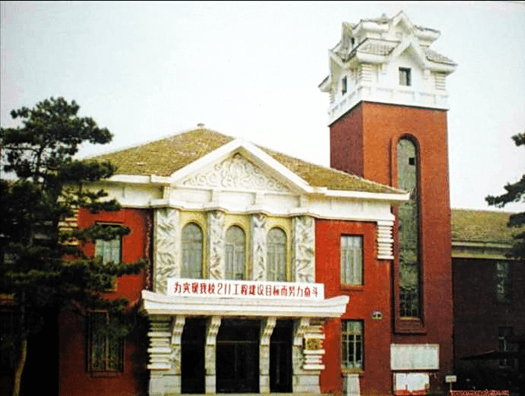
图8 1990年代的校部红楼

2015年9月吉林工业大学举行建校60周年纪念庆典，来自全国乃至世界各地的老校友返回阔别多年的母校，莘莘学子，情深意切，他们当中的许多人千万里来寻梦绕魂牵的校部红楼，却不见了踪影，旧址被一座逸夫楼所替代，在大楼的正门前台阶下摆着一座精心制作的老校部红楼模型，校友们围着这个模型，从各个角度观瞻拍照，有的人抚摸着模型感慨万千，情不自禁地热泪盈眶。（如图9）这就是地标性建筑的魅力。

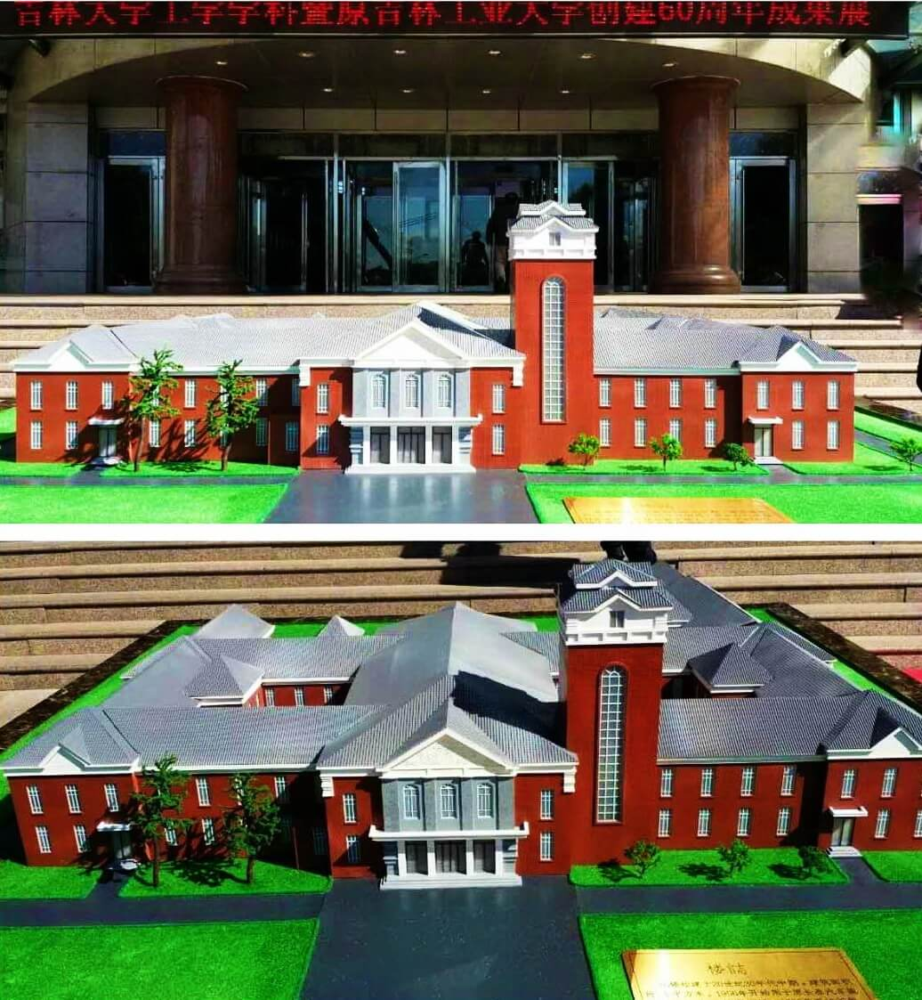
图9 校部红楼模型

无独有偶，2019年8月，“吉林工大附小校友及工大子弟大团圆联欢会”在工大礼堂举行，盛况空前，气氛热烈。大会组委会为每一位报名参加的校友特意定制了一枚熠熠生辉的纪念章，纪念章的图案选定的也是老校部红楼，为什么这座建筑如此深入老工大人的心间，为什么大家不约而同地把它当做老工大的精神象征，答案是它的标志性的形象已经永远铭刻在老工大人的心中，今生挥之不去。（图10）。

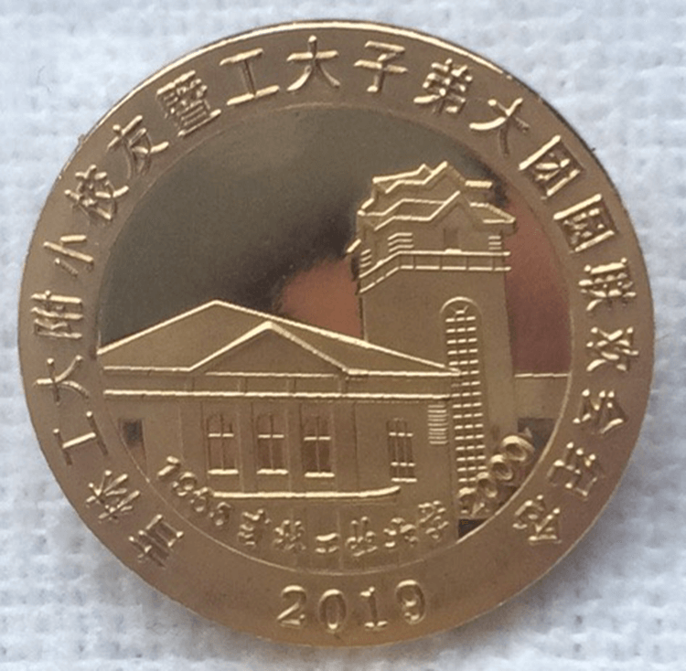
图10 工大附小校友暨工大子弟团圆纪念章（2019.7）

另一座值得一书的伪满时期的历史建筑就是位于吉林工业大学校园东北角的一校区（图11），多年来它作为工大机械系(含工经专业)为主的教学、办公、学生宿舍综合体，内部有一个高大空间场所，作为室内体育馆，很适合东北漫长而严寒的冬季体育健身。这座外观清水红砖的两层坡顶建筑平面布局呈打横的日字型，在建筑中部正入口处设计了一个外凸的平屋顶梯形门楼，外立面用水泥砂浆罩面，跟建筑主体做工考究的红砖勾缝外立面在材料和颜色上形成对比，主入口的上方建筑主体上设计了一个高大的三角形山墙，这些处理都是为了突显主入口的地位。整座建筑的外墙在二层窗户上方做成半圆形，并且在窗户之间设计了一个突出的壁柱，这些细部设计增加了建筑的阴影，丰富了立面的体积感和灵动感。如图12。

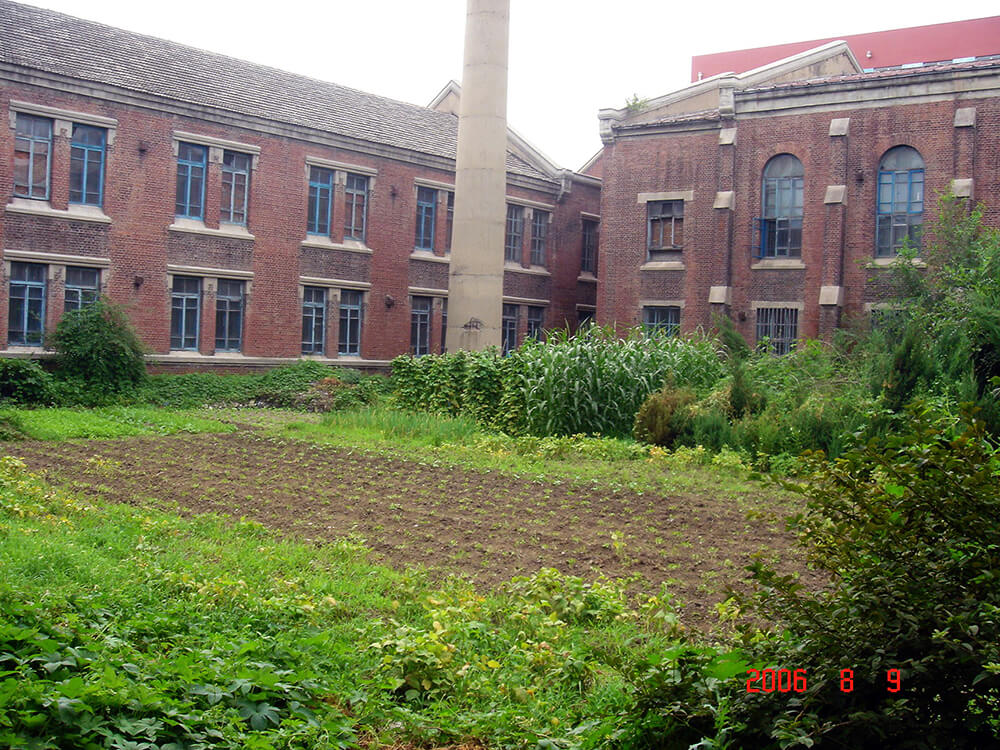
图11 一校区内院景观图

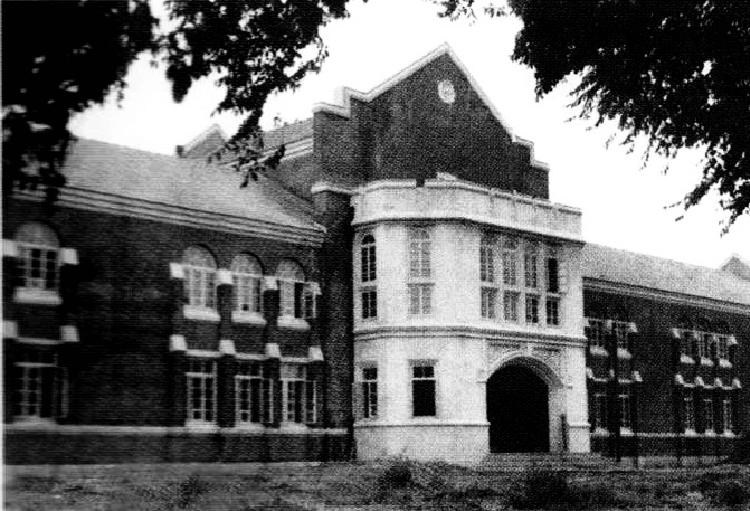
图12 1930-40年代的一校区

翻开它的建筑史，原来它是1938年建成的伪满洲国中央警察学校，是内有宿舍、办公、食堂、室内小体育馆和庭院的综合功能的教育建筑，随着时代的变迁和政权的更迭，这栋建筑里迎来送往了多少莘莘学子，演绎了多少人生故事，见证了多少历史沧桑。而它为之服务最长的单位就是吉林工业大学，不知什么时候它被斩断一半，西半部被拆去，残墙断壁，人去楼空，荒草萋萋，如图13所示。
